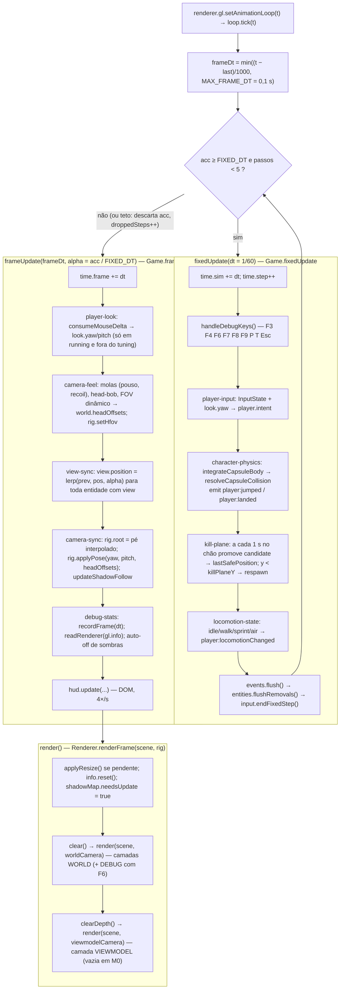

# LIMIAR — Arquitetura (M0, como está no código)

> Descreve o **código real** em `projects/limiar/src` na entrega do Milestone M0 (esqueleto: render, câmera em primeira pessoa, controlador de cápsula, mundo de teste). A fonte da verdade para decisões e números continua sendo o [design técnico](./02-design-tecnico.md); este documento mostra **como o design virou código**, com nomes de arquivos, assinaturas copiadas dos fontes e valores de `src/data`. Onde o código desviou do design, o desvio está listado na [seção 19](#19-divergências-entre-o-design-técnico-e-o-código).
>
> Convenções: identificadores em inglês; comentários e docs em PT-BR; nomes de jogo conforme o léxico (§14 do design): **Vigia** (jogador), **Campo de Provas** (mundo de teste), **Lume** (poder), slots **Ferro/Afim/Pesado**.

Documentos relacionados: [visão e design](./01-visao-e-design.md) · [design técnico](./02-design-tecnico.md) · [roadmap](./04-roadmap.md) · [performance](./05-performance.md) · [guia de desenvolvimento](./06-guia-de-desenvolvimento.md) · [decisões (ADRs)](./decisoes/README.md) · [README do projeto](../../projects/limiar/README.md).

---

## 1. Visão em uma tela

```
index.html  →  src/main.ts  →  game/game.ts (classe Game)
                                   │
        ┌──────────────────────────┼──────────────────────────────┐
        │  core/    plataforma     │  data/    números e defs     │
        │  loop, input, renderer,  │  MOVEMENT, CAMERA, FEEL,     │
        │  rig, eventos, física    │  RENDER, nível, léxico       │
        └──────────┬───────────────┴───────────────┬──────────────┘
                   │                               │
        world/  Octree + meshes + luzes     entities/  Vigia, mundo estático
                   │                               │
                systems/  lista ordenada em game/systems-list.ts
                   │
                ui/  overlay, HUD de debug, painel lil-gui (DOM, sem three)
```

Padrão (design §3.1): **módulos + entidades tipadas (dados puros) + sistemas ordenados + EventBus tipado**, sem ECS genérico ([ADR 0001](./decisoes/0001-sem-ecs-generico.md)). Three.js é detalhe de renderização: a simulação escreve `transform`; só `view-sync` e `camera-sync` tocam `Object3D`.

Números de referência do M0 (medidos no e2e em SwiftShader e no dev server):

| Métrica | Valor |
|---|---|
| Arquivos em `src/` | 62 (`.ts` + `styles.css` + `vite-env.d.ts`) |
| Draw calls por frame | **4** sem sombras · **8** com sombras (4 chunks + 4 da passada de sombra) · +5 com helpers (F6: grade 1 m, grade 10 m, eixos, Octree, cápsula) → 9 / 13 |
| Triângulos visíveis | ≈ 1,1–2,3 k conforme o frustum; Campo de Provas inteiro em 4 meshes (uma por quadrante) |
| Bundle de produção | `three` ≈ 539 kB (135 kB gz) + jogo ≈ 59 kB (21,4 kB gz) + CSS ≈ 2,6 kB (1,1 kB gz) |
| Testes | 11 suítes vitest (150 testes) + `e2e/smoke.mjs` |

---

## 2. Árvore de pastas e responsabilidades

Cada linha corresponde a um arquivo que existe em `projects/limiar/src/`.

### 2.1 `core/` — plataforma (não conhece o jogo)

| Arquivo | Responsabilidade | Exporta |
|---|---|---|
| `time.ts` | Constantes do relógio | `FIXED_DT = 1/60`, `MAX_FRAME_DT = 0.1`, `MAX_STEPS_PER_FRAME = 5` |
| `loop.ts` | Timestep fixo com interpolação; testável em Node (`tick(nowMs)`) | `LoopCallbacks`, `LoopStats`, `GameLoop` |
| `input.ts` | Estado de input por passo fixo; bordas; modo sintético `inject()`; handlers DOM | `ACTIONS`, `Action`, `InputBindings`, `InputState` |
| `pointer-lock.ts` | `requestPointerLock({ unadjustedMovement })` com fallback, cooldown e modo `unlocked` | `PointerLockMode`, `LockRequestResult`, `PointerLockController`, `DEFAULT_POINTER_LOCK_OPTIONS` |
| `renderer.ts` | `WebGLRenderer` em duas passadas, render scale, resize por `ResizeObserver`, tipo `RenderConfig` | `RenderConfig`, `Renderer`, `createRenderer`, `hasWebGL2` |
| `layers.ts` | Camadas de render | `Layer = { WORLD: 0, VIEWMODEL: 1, DEBUG: 2 }` |
| `camera-rig.ts` | Hierarquia root → head → câmeras; hFOV como fonte da verdade | `CameraRig`, `CameraRigOptions`, `HeadOffsets`, `createHeadOffsets`, `hfovToVfov` |
| `events.ts` | EventBus tipado (`emit` síncrono, `queue`/`flush`) | `EventBus<E>` |
| `entity.ts` | Id opaco, transform, base de entidade, armazém por `kind` | `EntityId`, `Transform`, `EntityBase`, `EntityStore`, `allocEntityId` |
| `debug-stats.ts` | FPS/frame time (janela 1 s; média longa de `longWindowSec` = `SHADOW_AUTO_OFF.windowSec`), `renderer.info`, `performance.mark` (limpo 1×/s) | `DebugStats`, `DebugStatsOptions`, `DebugStatsSnapshot` |
| `storage.ts` | Persistência versionada com migrations e validação | `SaveStore<T>`, `StorageLike`, `Migration`, `SaveEnvelope` |
| `url-flags.ts` | `?nolock ?shadows ?debug ?scale ?seed ?hud` | `UrlFlags`, `parseUrlFlags`, `readUrlFlags` |
| `math/index.ts` | Utilidades sem alocação; raio × cápsula analítico | `clamp`, `lerp`, `damp`, `moveTowards`, `moveTowardsVec2XZ`, `deg`, `rad`, `snapToGrid`, `RayContact`, `rayCapsule` |
| `math/spring.ts` | Mola amortecida com solução fechada (exata para qualquer dt); `kickToPeak`/`peakFactor` | `Spring` |
| `math/random.ts` | RNG determinístico (mulberry32) | `Random` |
| `physics/layers.ts` | Bitmask de colisão | `CollisionLayer`, `CollisionMask` |
| `physics/movement-config.ts` | **Tipo** dos parâmetros de movimento (valores em `data/`) | `MovementConfig` |
| `physics/collision-query.ts` | Interface que a resolução de colisão consome | `CapsuleHit`, `RayHit`, `CollisionQuery` |
| `physics/capsule-body.ts` | Corpo cápsula, intenção de movimento, integração pura | `CapsuleBody`, `MoveIntent`, `createCapsuleBody`, `createMoveIntent`, `jumpSpeedFor`, `integrateCapsuleBody`, `SPRINT_MIN_FORWARD` |
| `physics/collision-resolve.ts` | Push-out iterativo, slide, step-up, snap ao chão | `CollisionResolveResult`, `resolveCapsuleCollision` |

### 2.2 `data/` — só dados e tipos de dados (sem `three` como valor)

| Arquivo | Conteúdo |
|---|---|
| `index.ts` | `DEFS = { elements, factions, levels }`, `DefRegistry`, `LEVELS`, `DefinitionError`, `validateDefs`, `countDefs` |
| `palette.ts` | `PALETTE` (ocre, terracota, névoa lilás, ciano-vigia, magenta-maré, elementos, facções, raridades, props) |
| `elements.ts` | `ELEMENTS`: Brasa (`ember`), Ressonância (`resonance`), Névoa (`haze`) |
| `factions.ts` | `FACTIONS`: Axioma (`axiom`), Ferrugem (`rust`), Cepa (`strain`) com unidades previstas |
| `hot-config.ts` | `keepLive(hot, key, fresh, assign?)` — mantém a **mesma referência** do objeto de config entre edições (via `import.meta.hot.data`); `assignFlat`; `onConfigHotUpdate(fn)` — ouvintes avisados a cada substituição (ver §15) |
| `movement-config.ts` | `MOVEMENT` (mutável; `keepLive` + `import.meta.hot.accept()`), `LOCOMOTION`, `RESPAWN` |
| `camera-config.ts` | `CameraConfig` (tipo) e `CAMERA` (mutável; `keepLive`) |
| `feel-config.ts` | `FeelConfig` (tipo) e `FEEL` (mutável; `keepLive` com `assignFeel`, cópia por sub-objeto) |
| `render-config.ts` | `RENDER` (mutável; `keepLive` com `assignRenderConfig`), `assignRenderConfig`, `RENDER_SCALE_ALT = 0.75`, `SHADOW_AUTO_OFF` |
| `settings-defaults.ts` | `Settings`, `DEFAULT_SETTINGS`, `SETTINGS_SAVE_KEY = 'limiar.settings'`, `SETTINGS_SAVE_VERSION = 1`, `SETTINGS_MIGRATIONS`, `SETTINGS_RANGES`, `isSettings` |
| `input-bindings.ts` | `INPUT_BINDINGS: InputBindings` (`KeyboardEvent.code` → `Action`) |
| `levels/level-def.ts` | `Vec3`, `BoxDef`, `RampDef`, `CylinderDef`, `PrimitiveDef`, `SpawnTag`, `SpawnPoint`, `LevelDef` |
| `levels/test-ground.ts` | `TEST_GROUND` (Campo de Provas, `satisfies LevelDef`) e `TEST_GROUND_TOWER_TOP` |

### 2.3 `world/` — Three.js do mundo estático

| Arquivo | Responsabilidade |
|---|---|
| `collision-world.ts` | `CollisionWorld implements CollisionQuery`: Octree de `three/addons` + hitboxes analíticas + raycast com máscara + `debugHelper()` |
| `level-builder.ts` | `buildLevel(def): BuiltLevel` — primitivas → geometrias não indexadas com cor por vértice → mescla por quadrante → helpers de debug |
| `materials.ts` | `getMaterial('world')` (`MeshLambertMaterial` flat + `vertexColors`, cache) e `disposeMaterials()` |
| `lighting.ts` | `createLighting`, `applyLightingConfig`, `updateShadowFollow` (hemisférica + sol com sombra + `FogExp2`) |

### 2.4 `entities/` — dados puros com `kind`

| Arquivo | Conteúdo |
|---|---|
| `index.ts` | `AnyEntity = PlayerEntity \| StaticWorldEntity`, `EntityKind`, `ENTITY_KINDS`, `HasCapsuleBody`, `hasBody(e)` |
| `player.ts` | `PlayerEntity` (o Vigia), `Locomotion`, `createPlayer(cfg, spawn)` |
| `static-world.ts` | `StaticWorldEntity`, `createStaticWorld(level)` (usa `world/level-builder`) |

### 2.5 `systems/` — um objeto por responsabilidade, sem estado de entidades

| Arquivo | Fase | Faz |
|---|---|---|
| `system.ts` | — | `interface System { name; init?; fixedUpdate?; frameUpdate?; dispose? }` |
| `player-input.ts` | fixed #1 | `InputState` + `look.yaw` → `player.intent` |
| `character-physics.ts` | fixed #2 | para toda entidade com `body`: `integrateCapsuleBody` + `resolveCapsuleCollision`; emite `player:jumped`/`player:landed` |
| `kill-plane.ts` | fixed #3 | amostra `lastSafePosition` a cada 1 s de chão contínuo, com um estágio de atraso (`candidate`); `y < killPlaneY` → respawn; ouve `player:respawned` para reiniciar a amostra (P, T, `__limiar.respawn`); exporta `respawnPlayer`, `teleportPlayer` |
| `locomotion-state.ts` | fixed #4 | `idle/walk/sprint/air` + `player:locomotionChanged` |
| `player-look.ts` | frame #1 | mouse → `look.yaw/pitch`; `transform.yaw = look.yaw` |
| `camera-feel.ts` | frame #2 | molas de kick de pouso e recoil, FOV dinâmico, head-bob → `world.headOffsets` |
| `view-sync.ts` | frame #3 | `lerp(prev, pos, alpha)` → `entity.view` |
| `camera-sync.ts` | frame #4 | `rig.root` = pé interpolado; `rig.applyPose`; sombra segue o olhar |
| `debug-stats-system.ts` | frame #5 | alimenta `DebugStats`; auto-desliga sombras (§6.4 do design) |

### 2.6 `game/` — composição (pode importar tudo)

| Arquivo | Conteúdo |
|---|---|
| `game.ts` | classe `Game`: monta renderer, cena, rig, nível, colisão, jogador, luzes, entidades, sistemas, UI, pointer lock, loop; estados/pausa; atalhos de debug; ouve `onConfigHotUpdate` (HMR) e `config:changed`; API de debug |
| `world.ts` | `interface World`, `GameConfig`, `WorldInit`, `createWorld` |
| `events.ts` | `GameEvents`, `WeaponSlotId`, `CameraKick` |
| `state.ts` | `GameState`, `InputMode` |
| `systems-list.ts` | `createSystems()` — **única fonte da ordem** |
| `debug-api.ts` | `LimiarDebugApi`, `installDebugApi`, `uninstallDebugApi` (`window.__limiar`) |

### 2.7 `ui/` — DOM puro (sem `three`)

| Arquivo | Conteúdo |
|---|---|
| `styles.css` | reset, canvas 100 %, overlay, HUD, host do painel |
| `overlay.ts` | `Overlay` com estados `ready / paused / cooldown / contextlost / nowebgl2 / fatal` |
| `debug-hud.ts` | `DebugHud` (`<pre>`, 4×/s, F3) |
| `tuning-panel.ts` | `createTuningPanel` (lil-gui por `import()` dinâmico, F4, só DEV) |

### 2.8 Raiz do projeto

| Arquivo | Papel |
|---|---|
| `src/main.ts` | Bootstrap: checa WebGL2, `new Game({ container, canvas, ui })`, overlay de erro fatal |
| `src/vite-env.d.ts` | `window.__limiar?: LimiarDebugApi` |
| `index.html` | `#app > canvas#game + div#ui` |
| `vite.config.ts` | alias `@` → `src`, `base: './'`, chunk `three` via `rolldownOptions.output.codeSplitting` |
| `vitest.config.ts` | ambiente `node`, `tests/**/*.test.ts` |
| `e2e/smoke.mjs` | build → preview → Chromium headless → asserções (ver §17) |
| `tests/` | `architecture`, `core/{loop,input,events,spring,random,storage}`, `physics/{integrate,collision}`, `data/{definitions,hot-config}`, `helpers/fake-storage` |

---

## 3. Regras de dependência (verificadas por `tests/architecture.test.ts`)

O teste lê todos os fontes com `import.meta.glob('/src/**/*.ts', { query: '?raw' })` e checa os imports **de valor** (`import type` é ignorado).

| Pasta | Pode importar (valor) | Só como tipo |
|---|---|---|
| `core/` | `three`, `core/` | — |
| `data/` | `data/` | `core/` |
| `entities/` | `three`, `core/`, `data/`, `world/`, `entities/` | — |
| `world/` | `three`, `core/`, `data/`, `world/` | — |
| `systems/` | `three`, `core/`, `data/`, `entities/`, `world/`, `systems/` | `game/` |
| `ui/` | `core/`, `data/`, `ui/` | `game/` |
| `game/` e `src/main.ts` | tudo | — |

Consequências práticas visíveis no código:

- A interface que `resolveCapsuleCollision` consome (`CollisionQuery`) está em `core/physics/collision-query.ts`; `world/collision-world.ts` a implementa. `core/` nunca importa `world/`.
- `data/` não conhece o renderer, mas `render-config.ts` precisa de aplicação explícita após HMR. A ponte é `data/hot-config.ts`: o módulo de config se auto-aceita e chama `keepLive`, que avisa os ouvintes registrados por `onConfigHotUpdate`; `game/game.ts` é quem ouve e aplica (`Renderer.applyConfig` + `applyLightingConfig`). Assim `data/` continua sem importar `core/` como valor.
- `ui/tuning-panel.ts` carrega lil-gui com `import()` dinâmico (o teste só inspeciona imports estáticos).

---

## 4. Fluxo por frame



Pontos que o diagrama não mostra:

- Com o loop **pausado** (`ready`, `paused`, `error`) não há passos fixos, mas `frameUpdate` e `render` continuam com `alpha = 1`: a cena fica parada atrás do overlay e o resize funciona. Nesse estado o `frameUpdate` chama `handleDisplayKeys()` (F3/F7/F8, só apresentação/settings) e `input.endFixedStep()`, para essas bordas não ficarem presas; F4/F6/F9/P/T/Esc continuam só em `running`.
- `resume()` zera acumulador e relógio: o tempo passado em pausa não é integrado.
- `readRenderer` no `frameUpdate` lê os contadores do **frame anterior** (o `Renderer` chama `info.reset()` só no início de `renderFrame`).
- A ordem relativa de `systems-list.ts` vale para as duas fases: o loop percorre a lista inteira e chama só o método que cada sistema define.

---

## 5. Game loop (`core/loop.ts`)

```ts
export interface LoopCallbacks {
  fixedUpdate(dt: number): void;                 // 0..N vezes por frame, sempre com o mesmo dt
  frameUpdate(dt: number, alpha: number): void;  // 1x por frame; alpha ∈ [0,1]
  render(): void;
}
export class GameLoop {
  readonly stats: LoopStats; // { stepsLastFrame, frameDt, simTime, droppedSteps }
  constructor(cb: LoopCallbacks, fixedDt: number = FIXED_DT);
  get paused(): boolean;
  tick(nowMs: number): void;
  pause(): void;
  resume(): void;
}
```

| Valor | Onde | Efeito |
|---|---|---|
| `FIXED_DT = 1/60` | `core/time.ts` | simulação a 60 Hz; pulo sobe a mesma altura em 60 e 144 Hz |
| `MAX_FRAME_DT = 0.1` | `core/time.ts` | um frame nunca integra mais de 0,1 s (aba oculta, hitch) |
| `MAX_STEPS_PER_FRAME = 5` | `core/time.ts` | acima disso o resto do acumulador é **descartado** (`droppedSteps++`), sem espiral da morte |
| deslocamento máx. por passo | derivado | 8,5 m/s × 1/60 ≈ 0,14 m < raio 0,4 m → sem tunelamento |

O relógio vem de fora (`timestamp` do `setAnimationLoop` ≡ `performance.now()`), o que torna o loop testável em Node (`tests/core/loop.test.ts`). Decisão registrada na [ADR 0002](./decisoes/0002-fixed-timestep-60hz.md).

---

## 6. Input (`core/input.ts`, `data/input-bindings.ts`)

```ts
export const ACTIONS = ['forward','back','left','right','jump','sprint','crouch','fire','aim','reload',
  'melee','grenade','classAbility','super','interact','swapWeapon','debugHud','debugPanel','debugHelpers',
  'debugShadows','debugRenderScale','debugKick','debugRespawn','debugTeleport','pause'] as const;
export type Action = (typeof ACTIONS)[number];
export type InputBindings = Readonly<Record<string, Action>>;   // chave = KeyboardEvent.code | 'Mouse0..2' | 'Wheel'

export class InputState {
  constructor(bindings: InputBindings);
  isDown(a: Action): boolean;
  justPressed(a: Action): boolean;          // borda; limpa SÓ em endFixedStep()
  justReleased(a: Action): boolean;
  moveAxis(out: THREE.Vector2): THREE.Vector2;           // (x = direita, y = frente), normalizado se |v| > 1
  consumeMouseDelta(out: THREE.Vector2): THREE.Vector2;  // contagens acumuladas; zera
  endFixedStep(): void;
  reset(): void;                                          // solta tudo; não gera bordas de released
  inject(partial: Partial<Record<Action, boolean>>, mouseDelta?: [number, number]): void;
  onKeyCode(code: string, down: boolean): boolean;        // API crua (testável sem DOM)
  onMouseButton(button: number, down: boolean): boolean;
  onMouseMove(dx: number, dy: number): void;
  onWheel(): boolean;                                     // pulso: pressed + released no mesmo passo
  attach(target: HTMLElement): void;
  detach(): void;
}
```

Regras implementadas:

- **Bordas sobrevivem até o passo fixo.** `pressed`/`released` só são zerados em `endFixedStep()`, nunca por frame. A 144 Hz metade dos frames não tem passo fixo; um toque de pulo nesses frames chega ao próximo `fixedUpdate`. Testado em `tests/core/input.test.ts`.
- **Teclado por `code`** (`KeyW` funciona em ABNT2/AZERTY); `preventDefault` só em códigos mapeados; `event.repeat` ignorado; `blur` do `window` chama `reset()` (o `keyup` se perde ao trocar de janela).
- **Mouse**: `mousemove` acumula `movementX/Y`; `mousedown` no canvas, `mouseup` no documento; `contextmenu` bloqueado; `wheel` com `passive: false`.
- **Modo sintético (`inject`)**: uma ação com `true` fica "segurada" até o próximo `inject`/`reset` e é somada ao teclado físico; gera bordas como um teclado real. É o caminho do e2e e de bots/replay.

Mapeamento real (`data/input-bindings.ts`): `KeyW/ArrowUp forward · KeyS back · KeyA left · KeyD right · Space jump · ShiftLeft sprint · ControlLeft/KeyC crouch · Mouse0 fire · Mouse2 aim · KeyR reload · KeyF melee · KeyQ grenade · KeyE classAbility · KeyX super · KeyG interact · Wheel swapWeapon · F3 debugHud · F4 debugPanel · F6 debugHelpers · F7 debugShadows · F8 debugRenderScale · F9 debugKick · KeyP debugRespawn · KeyT debugTeleport · Escape pause`. Em M0 só movimento, pulo, sprint e atalhos de debug têm sistema; o resto está mapeado para M1+.

---

## 7. Estados, pausa e pointer lock (`game/state.ts`, `core/pointer-lock.ts`, `game/game.ts`)

```ts
export type GameState = 'booting' | 'ready' | 'running' | 'paused' | 'error';
export type InputMode = 'locked' | 'unlocked';
```

| Transição | Gatilho | O que acontece |
|---|---|---|
| `booting → ready` | fim do construtor de `Game` | loop criado **pausado**, overlay "Clique para jogar" |
| `ready/paused → running` | clique no overlay → `pointerLock.request()` resolve `'locked'` ou `'unlocked'` | `input.reset()`, overlay some, `loop.resume()`, `game:resumed` |
| `running → paused` | perda do lock em modo `locked` (Esc) fora do modo de tuning; `visibilitychange` hidden; Esc no modo `unlocked` | `loop.pause()`, `input.reset()`, sai do tuning, overlay "Pausado", `game:paused { reason }` |
| `* → error` | `webglcontextlost` | overlay de erro; sem WebGL2 o `Game` nem é criado (`main.ts`) |

`PointerLockController` (`core/pointer-lock.ts`):

- `request()` tenta `{ unadjustedMovement: true }`; `NotSupportedError` → tenta sem opções; Firefox devolve `undefined` e o desfecho chega por evento.
- **1ª falha consecutiva → `'cooldown'`** (`cooldownMs: 1200`; overlay com contador, clique desabilitado); **2ª falha → modo `'unlocked'`** (`failuresBeforeFallback: 2`): o mouse gira a câmera por `movementX/Y` sem lock e `Escape` pausa.
- `?nolock=1` → `forceUnlocked: true` → `request()` resolve `'unlocked'` na hora (e2e, iframes).

**Modo de tuning (F4, só DEV):** `world.tuningMode = true`, `exitPointerLock()`, painel lil-gui visível, **simulação continua**. `player-look` descarta o delta do mouse enquanto `tuningMode` ou fora de `running`. F4 de novo ou clique no canvas → `exitTuningMode(true)` → relock.

---

## 8. Câmera: rig, look e feel

### 8.1 Rig (`core/camera-rig.ts`)

```
rig.root (yaw)                                  ← camera-sync: position = pé interpolado
└── rig.head (pitch + offsets, ordem 'YXZ')     ← position.y = eyeHeight + offsets.y; x/z = offsets.x/back
    ├── rig.worldCamera      camadas WORLD (+DEBUG com F6); near 0,05; far 300; vfov derivado do hFOV
    └── rig.viewmodelRoot    "ombro" da arma (sway/ADS em M1)
        ├── rig.viewmodelCamera   camada VIEWMODEL; vfov 55° fixo; near 0,01; far 5
        └── rig.weaponSocket      vazio em M0; a arma de M1 é filha daqui
```

```ts
export interface HeadOffsets { pitch: number; yaw: number; roll: number; x: number; y: number; back: number }
export class CameraRig {
  eyeHeight: number; pitchClampRad: number; hfovDeg: number;
  constructor(opts: CameraRigOptions);
  setHfov(hfovDeg: number, aspect: number): void;        // recalcula as duas câmeras
  setDebugLayerVisible(visible: boolean): void;          // F6
  applyPose(yaw: number, pitch: number, offsets: HeadOffsets): void;  // clamp de pitch DEPOIS da soma
}
export function hfovToVfov(hfovDeg: number, aspect: number): number;
```

O corpo só tem yaw (`transform.yaw`); pitch fica na cabeça, então recoil nunca inclina a cápsula. `Renderer.onResize` reaplica `rig.hfovDeg` com o aspect novo (sem frame esticado).

### 8.2 Look (`systems/player-look.ts`, valores em `data/camera-config.ts`)

| Parâmetro | Valor | Uso |
|---|---|---|
| `hfovDeg` | 95 (faixa 80–110 em `SETTINGS_RANGES`) | `settings.hfovDeg` prevalece; vfov = `2·atan(tan(hfov/2)/aspect)` |
| `sensitivityDegPerCount` | 0,022 | `yaw −= dx · 0,022 · settings.sensitivityMultiplier · DEG2RAD` |
| `settings.sensitivityMultiplier` | 1,5 (0,1–5) | persistido |
| `pitchClampDeg` | 89 | aplicado no look e de novo em `applyPose` (após somar kicks) |
| `sprintFovAddDeg` / `fovDampLambda` | +6° / 10 | FOV dinâmico por `locomotion === 'sprint'` |
| `landFovKickDeg` / `landFovKickTime` | 3° / 0,1 s | encolhe o FOV no pouso |
| `viewmodelFovDeg` | 55 | câmera da arma |
| `adsMultiplier` | 0,8 | reservado para M1 |

Sem suavização nem aceleração ([ADR 0007](./decisoes/0007-hfov-e-sensibilidade-por-contagem.md)). O look roda no `frameUpdate` (taxa do monitor); `player-input` lê `look.yaw` no início do passo fixo.

### 8.3 Feel (`systems/camera-feel.ts`, valores em `data/feel-config.ts`)

Os offsets são **recalculados do zero a cada frame**; cada contribuição decai por mola ou `damp`, então nunca acumulam.

| Contribuição | Mecanismo | Valores |
|---|---|---|
| Kick de pouso | `player:landed { fallSpeed }` → `amp = clamp(fallSpeed / 20, 0, 1)`; molas `landPitch`, `landY` recebem `kickToPeak(−amp · x)` (impulso calibrado para o pico anunciado) | `pitchDeg 2.5`, `posY 0.06`, `zeta 0.6`, `omega 22` |
| Slot de recoil | `camera:kick { pitchDeg, yawDeg, posBack }` desloca `recoilOffsetPitch/Yaw` (alvo das molas); `recoveryDegPerSec` traz o alvo a zero; `recoilBack.kickToPeak(posBack)` | `zeta 0.55`, `omega 26`, `recoveryDegPerSec 18`, F9: `{ 1.2°, ±0.3°, 0.02 m }` |
| Head-bob | amplitude escala com `speed/walkSpeed`, zero no ar, `damp` de 10 | **desligado** por padrão (`enabled: false`), `ampY 0.018`, `ampX 0.01`, `rollDeg 0.25`, `hz 1.9` |

`Spring.step(dt)` aplica a solução fechada do oscilador amortecido (sub/crítico/super-amortecido): não diverge com dt grande (um frame de 0,1 s com ω = 26 explodia para NaN no Euler semi-implícito original) e o pico do kick não depende do frame rate (com Euler a 60 Hz o pico saía ~40 % menor que a 144 Hz). `kickToPeak(peak)` calibra o impulso pelo `peakFactor(ζ)` — a resposta ao impulso `kick(peak · ω)` atinge só ≈ 0,50 · peak em ζ = 0,6. Testes em `tests/core/spring.test.ts`.

---

## 9. Controlador de cápsula e colisão

### 9.1 Parâmetros (`data/movement-config.ts` — objeto `MOVEMENT`, tipo em `core/physics/movement-config.ts`)

| Campo | Valor | Campo | Valor |
|---|---|---|---|
| `capsuleRadius` | 0,4 m | `jumpHeight` | 1,4 m |
| `capsuleHeight` | 1,8 m | `jumpHoldGravityScale` | 0,5 |
| `eyeHeight` | 1,62 m | `jumpHoldDeadTime` / `jumpHoldMaxTime` | 0,08 s / 0,25 s |
| `walkSpeed` | 6,0 m/s | `maxFallSpeed` | −40 m/s |
| `sprintSpeed` | 8,5 m/s | `coyoteTime` | 0,1 s |
| `groundAccel` / `groundDecel` | 60 / 80 m/s² | `jumpBufferTime` | 0,1 s |
| `airAccel` / `airMaxSpeed` | 12 m/s² / 6,0 m/s | `slopeLimitDeg` | 46° |
| `gravity` | −24 m/s² | `stepHeight` | 0,35 m |
| | | `groundSnapDistance` | 0,4 m |

Constantes derivadas no mesmo arquivo: `LOCOMOTION.idleSpeed = 0.1` m/s e `RESPAWN.safeGroundedSeconds = 1`. `SPRINT_MIN_FORWARD = 0.5` (em `core/physics/capsule-body.ts`) é o mesmo critério de sprint usado pela integração e por `locomotion-state`.

### 9.2 Integração pura (`core/physics/capsule-body.ts`)

```ts
export function integrateCapsuleBody(
  t: Transform, body: CapsuleBody, intent: MoveIntent, cfg: MovementConfig, dt: number,
  out: { jumped: boolean },
): void;
export function jumpSpeedFor(cfg: MovementConfig, dt: number): number; // √(2·|g|·h) + |g|·dt/2
```

Passos: timers (coyote, jump buffer) → horizontal (`moveTowardsVec2XZ` com `groundAccel`/`groundDecel` no chão; no ar, *air-accelerate*: soma `airAccel·dt` só ao longo do `wish` até `min(speed, airMaxSpeed)`, nunca reduz o módulo existente — um sprint-jump segurando W mantém 8,5 m/s; frear é só empurrando contra a velocidade — e um clamp em `max(|vel| anterior, airMaxSpeed)` impede ganhar velocidade por strafe; sem atrito aéreo sem input) → pulo (buffer + coyote; coyote não vale após já ter pulado) → vertical (gravidade reduzida enquanto segura o pulo, depois de uma zona morta de `jumpHoldDeadTime` — o keydown que salta já chega com `jumpHeld` — e por até `jumpHoldMaxTime`; clamp em `maxFallSpeed`) → `prevPosition = position; position += vel·dt`. Convenção: yaw 0 → −Z, `right = +X`. Testado em `tests/physics/integrate.test.ts`.

### 9.3 Resolução de colisão (`core/physics/collision-resolve.ts`)

```ts
export interface CollisionResolveResult { landed: boolean; fallSpeed: number }
export function resolveCapsuleCollision(
  t: Transform, body: CapsuleBody, query: CollisionQuery, cfg: MovementConfig, out: CollisionResolveResult,
): void;
```

Algoritmo por passo (constantes locais: `MAX_ITERATIONS = 5`, `PUSH_EPSILON = 1e-3`, `MIN_HORIZONTAL_NORMAL = 1e-3`, `RAY_MARGIN = 0.05`):

1. `wasGrounded = body.grounded; body.grounded = false`; cápsula dos pés (`start = pé + r`, `end = pé + h − r`).
2. Até 5×: `capsuleIntersect` → empurra por `normal·(depth + 1 mm)`.
   - `normal.y ≥ cos(46°)` → chão: `grounded`, `groundNormal`, `vel.y = max(vel.y, 0)`.
   - Senão, se `wasGrounded && stepHeight > 0`: **tenta step-up primeiro** (`tryStepUp`); se falhar, `slide`.
3. `position = capsule.start − (0, r, 0)`.
4. **Snap ao chão** se `wasGrounded && !grounded && vel.y ≤ 0`: raio para baixo do centro dos pés e, se falhar e houver velocidade horizontal, um segundo raio na borda dianteira (`centro + r · dir(vel)`), alcance `groundSnapDistance + 0,05` (0,40 + 0,05 m: cobre a queda por passo na rampa-limite em sprint mais um degrau descido, sem grudar ao sair de um caixote de 1 m). A posição resultante deixa a esfera de baixo **tangente** ao plano: `pos.y = hit.point.y + r · (1 / hit.normal.y − 1)` — pés no ponto penetravam `r·(1 − cos θ)` e o push-out seguinte devolvia `r·(1/cos θ − 1)`: serrote de 12 cm a 40°.
5. `grounded` → `timeSinceGrounded = 0; airborneByJump = false`. `out.landed = !wasGrounded && grounded`; `out.fallSpeed = max(0, −vel.y antes do passo)`.

Detalhes que diferem do pseudocódigo do design (motivos verificados em teste; ver §19):

- **Step-up** dispara em qualquer contato não caminhável enquanto no chão (não só `normal.y < 0.3`): para degraus mais baixos que o raio a esfera toca a **aresta** e a normal é diagonal (0,25 m → `normal.y ≈ 0,44`). O raio de sondagem parte do lado do contato (`centro + r` na direção do obstáculo). A rampa íngreme continua rejeitada porque o chão de pouso precisa ser caminhável e a subida precisa caber em `stepHeight`.
- **Slide no chão usa só a projeção horizontal da normal.** O Octree devolve a normal **agregada** quando a cápsula toca chão + parede (ex.: `(−0,8, 0,6, 0)`); o slide completo convertia avanço em velocidade vertical e o corpo quicava. No ar (pulo contra parede, deslizar por rampa de 53°) e contra teto (`normal.y < 0`) vale a normal completa.

Cobertura em `tests/physics/collision.test.ts` (Octree real): rampas 20,6°/40°/53°, degraus 0,25/0,35/0,50, corredor de 1,2 m, pressionar parede sem quicar, raycast contra chão/hitbox/decor/prisma, Campo de Provas inteiro.

### 9.4 Mundo de colisão (`world/collision-world.ts`) e a interface de `core`

```ts
// core/physics/collision-query.ts
export interface CapsuleHit { normal: THREE.Vector3; depth: number }
export interface RayHit { point: THREE.Vector3; normal: THREE.Vector3; distance: number; layer: CollisionMask; entity: EntityId | null }
export interface CollisionQuery {
  capsuleIntersect(c: Capsule, out: CapsuleHit): boolean;
  raycast(origin: THREE.Vector3, dir: THREE.Vector3, maxDist: number, mask: CollisionMask, out: RayHit): boolean;
}

// core/physics/layers.ts
export const CollisionLayer = { None: 0, World: 1, Player: 2, Enemy: 4, Projectile: 8, Pickup: 16, All: 0xffff } as const;
export type CollisionMask = number;

// world/collision-world.ts
export interface Hitbox { entity: EntityId; layer: CollisionMask; capsule: Capsule }
export class CollisionWorld implements CollisionQuery {
  get bounds(): THREE.Box3;
  rebuildStatic(root: THREE.Object3D): void;      // Octree novo + fromGraphNode(root)
  capsuleIntersect(c: Capsule, out: CapsuleHit): boolean;
  raycast(origin, dir, maxDist, mask, out: RayHit): boolean;   // Octree (mask & World) + hitboxes (layer & mask); o mais próximo
  addHitbox(h: Hitbox): void;                     // lança se a entidade já tem hitbox; cápsula guardada por referência
  removeHitbox(entity: EntityId): void;
  get hitboxCount(): number;
  debugHelper(): THREE.Object3D;                  // UM LineSegments com as arestas de todos os nós (camada DEBUG)
}
```

Octree/Capsule de `three/addons` ([ADR 0003](./decisoes/0003-octree-three-addons.md)). `Octree.capsuleIntersect`/`rayIntersect` alocam por chamada — custo aceito do addon oficial e um dos gatilhos de migração para `three-mesh-bvh` (a troca fica isolada neste arquivo). O jogador usa `layer: Player`, `mask: World`.

---

## 10. Renderização (`core/renderer.ts`, `world/lighting.ts`, `world/materials.ts`)

```ts
export interface RenderConfig {
  pixelRatioCap: number; renderScale: number; shadows: boolean; shadowMapSize: number;
  toneMappingExposure: number; clearColor: number; fogDensity: number;
  lights: { hemiSkyColor; hemiGroundColor; hemiIntensity; sunColor; sunIntensity; sunElevationDeg; sunAzimuthDeg };
  shadow: { frustumSize; near; far; bias; normalBias; followDistance; lightDistance };
}
export class Renderer {
  readonly gl: THREE.WebGLRenderer;
  onResize: ((cssWidth: number, cssHeight: number, aspect: number) => void) | null;
  constructor(canvas: HTMLCanvasElement, container: HTMLElement, cfg: RenderConfig);
  get cssWidth / cssHeight / aspect / renderScale;
  setRenderScale(scale: number): void;
  applyConfig(cfg: RenderConfig, scene?: THREE.Scene): void;  // passe scene ao ligar/desligar sombras (materiais recompilam)
  renderFrame(scene: THREE.Scene, rig: CameraRig): void;
  dispose(): void;
}
export function createRenderer(canvas, container, cfg): Renderer;  // lança sem WebGL2
export function hasWebGL2(canvas: HTMLCanvasElement): boolean;
```

Valores de `data/render-config.ts` (`RENDER`):

| Grupo | Valores |
|---|---|
| Renderer | `antialias: true`, `powerPreference: 'high-performance'`, `stencil: false`, `NeutralToneMapping`, exposição 1,0, `SRGBColorSpace`, `PCFShadowMap`, `pixelRatioCap 1.5`, `renderScale 1` |
| Névoa / clear | `FogExp2(PALETTE.fog = 0x8d7f9c, 0.01)`; `clearColor` = mesma cor (horizonte some sem skybox) |
| Luzes | `HemisphereLight(fog, hemiGround 0x5a4634, 1.0)` + `DirectionalLight(sunAmber 0xffc98a, 2.2)`, elevação 22°, azimute 35°; `layers.enableAll()` |
| Sombra | `shadowMapSize 2048`, frustum 60 × 60 m, near 1 / far 150, `bias −0.0005`, `normalBias 0.02`, `followDistance 8`, `lightDistance 80` |
| Material | um `MeshLambertMaterial({ flatShading: true, vertexColors: true })` para todo o mundo estático |

Duas passadas ([ADR 0006](./decisoes/0006-viewmodel-duas-cameras.md)): `autoClear = false`; `shadowMap.autoUpdate = false` + `needsUpdate = true` uma vez por frame (a sombra não é renderizada duas vezes); `info.autoReset = false` + `info.reset()` no início do frame para os contadores somarem as duas passadas. A passada de viewmodel roda sempre, mesmo vazia, para o número de performance do M0 ser honesto.

**Sombra segue o jogador** (`updateShadowFollow(lighting, playerPos, forward, cfg)`, chamado por `camera-sync`): alvo = pé + `forward · 8 m`, levado ao espaço da luz por `lightBasisInverse` (rotação pura calculada em `applyLightingConfig`), arredondado à grade de texels (`60 / 2048 ≈ 0,029 m`) e devolvido ao mundo. Elimina o shimmer ao andar.

**Auto-desligar sombras** (`systems/debug-stats-system.ts`, `SHADOW_AUTO_OFF = { frameAvgMs: 20, windowSec: 3, graceSec: 6 }`): só em `running`, só após `graceSec` (6 s) **com sombras ligadas** — contado desde que foram ligadas (início da sessão, F7, painel ou HMR: todos passam por `cfg.render.shadows`), para que a média de 3 s medida sem sombras não condene as sombras recém-ligadas —, uma única vez; não altera `settings.shadows`; emite `config:changed { path: 'render.shadows' }` e `render:shadowsChanged { enabled: false, auto: true }`; o HUD mostra "sombras AUTO-OFF (F7 religa)". Sem pós-processamento ([ADR 0004](./decisoes/0004-sem-pos-processamento.md)).

---

## 11. Mundo estático (`data/levels/*`, `world/level-builder.ts`)

`LevelDef` é dado; `buildLevel` gera meshes e o `Group` de colisão:

```ts
export interface BuiltLevel {
  staticRoot: THREE.Group;     // collisionRoot + 'decor' (collider: false); adicione à cena
  collisionRoot: THREE.Group;  // só meshes com colisão → CollisionWorld.rebuildStatic
  helpers: THREE.Group;        // GridHelper 1 m + 10 m + AxesHelper, camada DEBUG
  playerSpawn: SpawnPoint;
  stats: { meshes: number; triangles: number };
}
export function buildLevel(def: LevelDef): BuiltLevel;
```

- Primitivas: `box` (BoxGeometry centrada na base, `rotY`, `collider?`), `ramp` (prisma manual de 8 triângulos com enrolamento CCW — o Octree faz backface culling), `cylinder` (faixas coloridas por centróide do triângulo).
- Tudo vira geometria **não indexada** com `position/normal/color` (uv removido) e é mesclado por **quadrante** (`mergeGeometries`) → ≤ 4 meshes com `castShadow = receiveShadow = true`, `matrixAutoUpdate = false`, material `getMaterial('world')`.
- `validateDefs(DEFS)` (`data/index.ts`) roda em DEV e em `tests/data/definitions.test.ts`: ids únicos, cores hex, `killPlaneY < 0`, spawn `player` presente, spawns dentro de `bounds`, nomes de props únicos ([ADR 0005](./decisoes/0005-dados-em-ts-sem-zod.md)).

Campo de Provas (`TEST_GROUND`): chão em 4 lajes com buraco 4 × 4 em (20, 20) → kill plane em `y = −20`; paredes de borda em ±60; réguas de 1/2/3 m e poste de 1,80 m; 6 muretas em arco com `coverPoints`; 4 pilares e muro longo; 12 caixotes (8 soltos + 2 pilhas); 3 blocos grandes; escada 0,25/0,50/0,75/1,00; rampas de 20,6° (com plataforma), 40° e 53°; plataformas de 1,2/1,8/2,6 m; torre de 6 m (`TEST_GROUND_TOWER_TOP` = tecla T); corredor de 1,2 m; 5 alvos cilíndricos a 10–60 m; spawn do Vigia em (0, 0, 12) olhando −Z e 4 spawns `enemy` reservados.

---

## 12. Entidades (`core/entity.ts`, `entities/`)

```ts
export type EntityId = number & { readonly __brand: 'EntityId' };
export interface Transform { position: THREE.Vector3; prevPosition: THREE.Vector3; yaw: number }
export interface EntityBase { readonly id: EntityId; readonly kind: string; alive: boolean; transform: Transform; view?: THREE.Object3D }
export class EntityStore<E extends EntityBase> {
  add<T extends E>(e: T): T;                 // imediato; lança se o id já existe
  remove(id: EntityId): void;                // alive = false; sai das listas em flushRemovals()
  get(id: EntityId): E | undefined;
  ofKind<K extends E['kind']>(kind: K): readonly Extract<E, { kind: K }>[];  // array estável
  all(): Iterable<E>;
  flushRemovals(): void;                     // splice preserva a ordem de inserção
  get size(): number;
}

// entities/player.ts — o Vigia
export type Locomotion = 'idle' | 'walk' | 'sprint' | 'air';
export interface PlayerEntity extends EntityBase {
  readonly kind: 'player';
  body: CapsuleBody; intent: MoveIntent;
  look: { yaw: number; pitch: number };
  locomotion: Locomotion;
  lastSafePosition: THREE.Vector3;
  view: THREE.Group;                         // vazio em M0; recebe a cápsula wireframe de F6
}
export function createPlayer(cfg: MovementConfig, spawn: SpawnPoint): PlayerEntity;

// entities/static-world.ts
export interface StaticWorldEntity extends EntityBase { readonly kind: 'static'; root: THREE.Group; built: BuiltLevel; level: LevelDef; view: THREE.Group }
export function createStaticWorld(level: LevelDef): StaticWorldEntity;

// entities/index.ts
export type AnyEntity = PlayerEntity | StaticWorldEntity;
export const ENTITY_KINDS: readonly EntityKind[] = ['player', 'static'];
export interface HasCapsuleBody { body: CapsuleBody; intent: MoveIntent }
export function hasBody(e: AnyEntity): e is AnyEntity & HasCapsuleBody;
```

Composição transversal é por interface + type guard (`hasBody`), nunca por herança. `character-physics` e `view-sync` percorrem `ENTITY_KINDS × entities.ofKind()` com loops indexados — nada de iteradores de `Map` no hot path.

---

## 13. Sistemas e o `World` (`systems/system.ts`, `game/world.ts`, `game/systems-list.ts`)

```ts
export interface System {
  readonly name: string;
  init?(world: World): void;
  fixedUpdate?(world: World, dt: number): void;
  frameUpdate?(world: World, dt: number, alpha: number): void;
  dispose?(world: World): void;
}

export interface GameConfig { movement: MovementConfig; camera: CameraConfig; feel: FeelConfig; render: RenderConfig }
export interface World {
  readonly scene: THREE.Scene;
  readonly rig: CameraRig;
  readonly renderer: Renderer;
  readonly lighting: Lighting;
  readonly input: InputState;
  readonly events: EventBus<GameEvents>;
  readonly collision: CollisionWorld;
  readonly rng: Random;
  readonly entities: EntityStore<AnyEntity>;
  readonly cfg: GameConfig;              // objetos MUTÁVEIS (HMR/painel); sistemas leem no uso
  readonly level: LevelDef;
  readonly settings: Settings;
  readonly stats: DebugStats;
  readonly headOffsets: HeadOffsets;     // camera-feel escreve, camera-sync lê
  readonly flags: UrlFlags;
  readonly debug: boolean;               // DEV || ?debug=1
  player: PlayerEntity;
  state: GameState;
  tuningMode: boolean;
  time: { sim: number; frame: number; step: number };
}

export function createSystems(): readonly System[];  // a ordem da §4 deste documento
```

Sistemas são fábricas (`createXSystem()`) que fecham sobre caches próprios (molas, objetos `out`), nunca sobre estado de entidades. `Game` chama `init` de todos após montar o `World` e `dispose` em `Game.dispose()`.

---

## 14. Eventos (`core/events.ts`, `game/events.ts`)

```ts
export class EventBus<E extends { [K in keyof E]: object }> {
  on<K extends keyof E>(type: K, fn: (p: E[K]) => void): () => void;   // devolve unsubscribe
  once<K extends keyof E>(type: K, fn: (p: E[K]) => void): () => void;
  emit<K extends keyof E>(type: K, payload: E[K]): void;   // síncrono; aninhado até 16 níveis
  queue<K extends keyof E>(type: K, payload: E[K]): void;  // entregue em flush()
  flush(): void;                                           // até 64 passadas se handlers enfileiram mais
  clear(): void;
}
```

Eventos definidos em `GameEvents`:

| Evento | Payload | Quem emite hoje |
|---|---|---|
| `game:stateChanged` | `{ from, to }` | `Game.setState` |
| `game:paused` | `{ reason: 'pointerlock' \| 'visibility' \| 'user' }` | `Game.pause` |
| `game:resumed` | `{}` | `Game.run` |
| `input:lockChanged` | `{ locked, mode }` | `Game.handleLockChange` |
| `player:jumped` | `{ fromGround }` | `character-physics` |
| `player:landed` | `{ fallSpeed }` | `character-physics` → ouvido por `camera-feel` |
| `player:locomotionChanged` | `{ from, to }` | `locomotion-state` |
| `player:respawned` | `{ reason: 'killplane' \| 'debug' }` | `kill-plane` |
| `camera:kick` | `CameraKick { pitchDeg, yawDeg, posBack }` | F9 / painel → ouvido por `camera-feel` |
| `render:shadowsChanged` | `{ enabled, auto }` | `debug-stats-system`, `Game.applySettings` |
| `config:changed` | `{ path }` | HMR (`path` = `'movement' \| 'camera' \| 'feel' \| 'render'`), painel e atalhos (`'render.shadows'`, `'settings.hfovDeg'`…), auto-off de sombras → ouvido por `Game`, que reaplica renderer + luzes quando `path` começa com `render` |
| reservados | `weapon:fired`, `hit:confirmed`, `entity:died`, `loot:dropped`, `item:equipped`, `power:changed` | assinaturas fixadas; sistemas em M1+ |

Regra: `emit` para reações no mesmo frame (kick de câmera, hitmarker); `queue` para consequências que criam/removem entidades — o loop chama `events.flush()` e **depois** `entities.flushRemovals()` ao fim de cada passo fixo, fora das iterações. `WeaponSlotId = 'iron' | 'attuned' | 'heavy'` (Ferro/Afim/Pesado) já vive em `game/events.ts`.

---

## 15. Configuração orientada a dados, HMR e settings

### 15.1 Três caminhos para um número chegar ao jogo

| Caminho | Quem muda | Como chega |
|---|---|---|
| Arquivo em `src/data/*-config.ts` | editor + HMR do Vite | os quatro módulos (`movement`, `camera`, `feel`, `render`) se **auto-aceitam** (`import.meta.hot.accept()` literal no fonte) e exportam `keepLive(import.meta.hot, key, fresh, assign)`: a versão nova encontra o objeto vivo em `import.meta.hot.data[key]`, copia os valores por cima (`Object.assign`; `feel` e `render` copiam por sub-objeto para não trocar referências que o painel liga) e o reexporta. Sistemas leem `world.cfg.x.y` **no momento do uso**, então o valor vale no passo seguinte |
| Painel lil-gui (F4) | usuário em DEV | liga direto nos objetos de `world.cfg`; `render`/`settings` chamam hooks (`onRenderChanged`, `onSettingsChanged`) porque exigem aplicação explícita; `.listen()` mantém os sliders sincronizados com HMR e atalhos |
| Flags de URL e `Settings` | usuário | `?shadows ?scale ?hud` sobrepõem sem persistir; atalhos F3/F7/F8 mudam `settings` e persistem |

```ts
// data/hot-config.ts
export function keepLive<T extends object>(hot: ImportMeta['hot'], key: string, fresh: T, assign: (live: T, fresh: T) => void = assignFlat): T;
export function onConfigHotUpdate(fn: (key: string) => void): () => void;   // devolve unsubscribe
```

Por que não o `import.meta.hot.accept((mod) => Object.assign(MOVEMENT, mod.MOVEMENT))` do design: verificado com `vite dev` + Chromium, a 1ª edição aplica (6 → 7) e as seguintes não — o Vite descarta os callbacks da versão antiga quando a nova se registra, e o callback da v2 copia sobre o objeto órfão da v2, não sobre o que `game.ts` segura. Com `keepLive`, edições 6 → 7 → 8 → 9 chegam ao jogo sem reload (`tests/data/hot-config.test.ts` cobre a mesma referência em três "edições").

`render-config` precisa de aplicação explícita: `game.ts` registra `onConfigHotUpdate(handleConfigHotUpdate)`; para `key === 'render'` **restaura `shadows`/`renderScale` das settings do usuário** por cima do arquivo e, para qualquer chave, emite `config:changed { path: key }`. O listener de `config:changed` em `Game` reaplica `renderer.applyConfig(cfg, scene)` + `applyLightingConfig(lighting, scene, cfg)` quando `path` começa com `render`. Antes dessa mudança o `render-config` era importado também por `settings-defaults.ts` e `debug-stats-system.ts` (que não aceitavam), a propagação chegava à raiz e o Vite fazia **page reload** a cada edição.

### 15.2 Settings persistidas (`data/settings-defaults.ts`, `core/storage.ts`)

```ts
export interface Settings { sensitivityMultiplier: number; hfovDeg: number; shadows: boolean; renderScale: number; debugHud: boolean }
export const DEFAULT_SETTINGS = { sensitivityMultiplier: 1.5, hfovDeg: 95, shadows: true, renderScale: 1, debugHud: import.meta.env.DEV };

export class SaveStore<T> {
  constructor(opts: { key: string; version: number; migrations: readonly Migration[]; validate: (p: unknown) => p is T; storage?: StorageLike; now?: () => number });
  load(): T | null;   // null se ausente, JSON inválido, versão mais nova ou validate falhar
  save(payload: T): void;
  clear(): void;
}
```

Envelope `{ version, savedAt, payload }` em `localStorage['limiar.settings']`, versão 1, `migrations[v − 1]` converte `v → v + 1` (exige `migrations.length === version − 1`). `isSettings` rejeita valores fora de `SETTINGS_RANGES` (volta ao padrão). Inventário/loadout de M4 usarão a mesma classe.

---

## 16. Handle de debug e e2e (`game/debug-api.ts`, `ui/debug-hud.ts`)

```ts
export interface LimiarDebugApi {
  readonly world: World;
  readonly loop: GameLoop;
  readonly renderer: Renderer;
  readonly stats: DebugStats;
  readonly input: { inject: InputState['inject'] };
  respawn(): void;              // respawnPlayer(world, 'debug')
  readonly state: GameState;    // getter
  ready: boolean;               // true quando o jogo terminou de montar
}
```

Instalado em `window.__limiar` quando `import.meta.env.DEV || ?debug=1`. Do console ou do e2e:

```js
__limiar.input.inject({ forward: true });            // segura W até o próximo inject/reset
__limiar.input.inject({}, [-2727, 0]);               // ~90° à esquerda: dx = −90 / (0,022 × 1,5)
__limiar.input.inject({ jump: true });               // borda de pulo
__limiar.world.events.on('player:landed', console.log);
__limiar.world.time.sim;                             // tempo simulado (espera do e2e)
```

HUD de debug (F3, `settings.debugHud`, ligado por padrão em DEV): `<pre>` atualizado 4×/s com FPS/avg/max, passos e drops do loop, `renderer.info` (draw/tris/geom/tex/prog), dpr/escala/resolução, sombras (inclusive "AUTO-OFF"), posição/velocidade/estado de locomoção/normal do chão/coyote, look/hfov/vfov/sensibilidade, lock (`LOCKED/UNLOCKED/NOLOCK/TUNING`), entidades, `countDefs(DEFS)`, seed e a legenda dos atalhos.

Atalhos (lidos em `Game.handleDebugKeys`, por borda no passo fixo; F3/F7/F8 saem de `handleDisplayKeys`, chamado também no `frameUpdate` com o loop pausado): **F3** HUD · **F4** painel/modo de tuning (DEV) · **F6** helpers (grades, eixos, Octree mesclado, cápsula wireframe — camada DEBUG; criados na primeira vez) · **F7** sombras (persiste) · **F8** render scale 1,0 ↔ 0,75 (persiste) · **F9** kick de recoil (yaw com sinal do `rng`) · **P** respawn no spawn · **T** teleporte ao topo da torre (P/T só com `world.debug`) · **Esc** pausa no modo sem lock.

Flags de URL: `?nolock=1` · `?shadows=0|1` · `?scale=0.25–1` · `?hud=0|1` · `?debug=1` · `?seed=N`.

---

## 17. Verificação

```bash
cd projects/limiar
npm install              # uma vez
npm run dev              # http://127.0.0.1:5173 (HUD ligado, F4 painel, P/T ativos, validateDefs roda)
npm run typecheck        # tsc src/tests + tsconfig.node.json (e2e com checkJs)
npm test                 # vitest: 11 suítes, 150 testes
npm run build && npm run preview   # http://127.0.0.1:4173
npm run test:e2e         # node e2e/smoke.mjs
npm run check            # typecheck + test + build + e2e (~1 min)
```

O smoke test (`e2e/smoke.mjs`, só `playwright-core`) abre `http://127.0.0.1:<porta livre>/?nolock=1&shadows=0&debug=1&seed=1` em Chromium headless com SwiftShader, clica em `.overlay`, injeta input por `window.__limiar.input.inject` e espera por **tempo simulado** (`world.time.sim`, porque em SwiftShader frames > 0,1 s descartam tempo). Sem Chromium (`CHROMIUM_PATH` → `/opt/pw-browsers/chromium` → `chromium.executablePath()`), pula com exit 0 e instrução de instalação.

Lista de verificação do e2e (todas verdes na entrega):

- [x] zero `console.error` / `pageerror` / `requestfailed`
- [x] `state === 'running'` e `renderer.gl.capabilities.isWebGL2`
- [x] andou ≥ 4 m para −Z em 1 s simulado
- [x] virou 90° ± 5° por injeção de mouse e andou ≥ 1,5 m para −X
- [x] pulou e voltou a `grounded`
- [x] `drawCalls ≤ 30` (medido: 4) e `fps > 5`
- [x] screenshots em `e2e/artifacts/smoke*.png` + `smoke.json`

Regras de qualidade mantidas no código: zero `any`; zero alocação por passo/frame nos hot paths (scratch `Vector3`/`Capsule` por módulo, parâmetros `out`; `snapshot()`, `queue()` e `debugHelper()` alocam de propósito fora do hot path); números fora de `src/data` só como constantes locais nomeadas e comentadas; comentários explicam decisões não óbvias.

---

## 18. Como armas, inimigos, loot, classes e Lume vão plugar aqui

Ajuste do §11 do design aos nomes reais do código. Em todos os casos entram **arquivos novos** em `data/`, `entities/`, `systems/`, `ui/`, linhas em `game/systems-list.ts` e alternativas em `AnyEntity`/`ENTITY_KINDS`. Os contratos de `core/` e `world/` não mudam.

### 18.1 Armas (M1)

| Precisa de | Já existe | Onde |
|---|---|---|
| Socket da arma com câmera e FOV próprios | `rig.weaponSocket` sob `rig.viewmodelRoot`; `rig.viewmodelCamera` (camada `VIEWMODEL`, 55°); luzes com `layers.enableAll()` | `core/camera-rig.ts`, `core/layers.ts`, `world/lighting.ts` |
| Segunda passada de render | `Renderer.renderFrame` já renderiza a camada 1 com `clearDepth` | `core/renderer.ts` |
| Hitscan que distingue mundo de inimigo | `world.collision.raycast(origem, dir, range, CollisionLayer.World \| CollisionLayer.Enemy, out)` com `RayHit.entity` e `RayHit.layer` | `world/collision-world.ts` |
| Recoil por mola | `camera:kick` → slot de recoil em `camera-feel` (`recoilOffset` = alvo; `recoveryDegPerSec`) | `systems/camera-feel.ts`, `data/feel-config.ts` |
| Dispersão por estado de movimento | `player.locomotion` + `player:locomotionChanged` | `entities/player.ts`, `systems/locomotion-state.ts` |
| Ações de input | `fire`, `aim`, `reload`, `swapWeapon` já mapeados (`Mouse0`, `Mouse2`, `KeyR`, `Wheel`) | `data/input-bindings.ts` |
| Tipo do slot | `WeaponSlotId = 'iron' \| 'attuned' \| 'heavy'`; eventos `weapon:fired`, `hit:confirmed` reservados | `game/events.ts` |

A fazer: `data/weapons/{weapon-def.ts, …}` com `WeaponDef` (`satisfies`), `DEFS.weapons` + regras em `validateDefs`; `systems/weapons.ts` (`fixedUpdate`, inserido entre `kill-plane` e `locomotion-state`) contando rpm em passos fixos e emitindo `weapon:fired { weaponId, kick }`; `systems/viewmodel-anim.ts` (`frameUpdate`, entre `camera-sync` e `debug-stats`) para sway/ADS/sprint pose no `viewmodelRoot`; `ui/combat-hud.ts` para hitmarker; `core/audio.ts`; troca do kick sintético de F9 pelo `recoilPattern`; crouch (ações `crouch` já mapeadas).

### 18.2 Inimigos e IA (M2)

| Precisa de | Já existe |
|---|---|
| Mover inimigos com a mesma física | `character-physics` percorre `ENTITY_KINDS × ofKind()` e move **qualquer** entidade com `hasBody(e)` — a IA só escreve `intent` |
| Hitbox por entidade | `collision.addHitbox({ entity, layer: CollisionLayer.Enemy, capsule })` (cápsula por referência; quem move atualiza) |
| Linha de visão e cobertura | `collision.raycast(...)` com `CollisionLayer.World`; `level.coverPoints` (6 pontos no Campo de Provas) |
| Spawns | `level.spawnPoints` com `tag: 'enemy'` (4 já definidos) |
| Facções e elementos | `FACTIONS` (Axioma/Ferrugem/Cepa) e `ELEMENTS` (Brasa/Ressonância/Névoa) em `data/` |
| Remoção segura durante iteração | `events.queue('entity:died', …)` + `entities.remove(id)` → `flushRemovals()` ao fim do passo |
| Relógio para regeneração | `world.time.sim` |

A fazer: `entities/enemy.ts` (`EnemyEntity` com `kind: 'enemy'`, `body`, `intent`, `def`, `faction`, `ai`, `hitbox`; `AnyEntity` e `ENTITY_KINDS` ganham `'enemy'`), `systems/spawn.ts`, `systems/ai.ts` (máquina de estados testável em vitest com `CollisionQuery` sintético), `systems/damage.ts`, `systems/regen.ts`, `entities/projectile.ts` + `systems/projectiles.ts` (raio por passo com máscara `World | Player`).

### 18.3 Classe Rastreador e habilidades (M3)

Ações `grenade`, `melee`, `classAbility`, `super` já mapeadas (`KeyQ`, `KeyF`, `KeyE`, `KeyX`). A fazer: `data/classes/ranger.ts` (`ClassDef`), `data/abilities/*.ts` (`AbilityDef`), `systems/abilities.ts` com cooldowns em passos fixos; Investida = impulso em `player.body.velocity` por N passos (acima de 24 m/s, sub-passos de colisão dentro do mesmo `fixedUpdate`, porque o deslocamento por passo precisa ficar < `capsuleRadius`); **Ápice** acumula carga por dano/abates; HUD de cooldowns em DOM.

### 18.4 Loot, inventário, Lume e persistência (M4)

| Precisa de | Já existe |
|---|---|
| Rolagem reprodutível | `world.rng` (`Random`, seed por `?seed=` ou `Date.now()`) |
| Cores de raridade | `PALETTE.rarityCommon … rarityExotic` |
| Persistência versionada com migrations | `SaveStore<T>` (mesma classe das settings) |
| Eventos | `loot:dropped`, `item:equipped`, `power:changed { lume }` reservados; `entity:died` entregue no `flush` |
| Overlap de coleta | `CollisionLayer.Pickup` reservado; `rayCapsule` em `core/math` para volumes analíticos |

A fazer: `RarityDef`, `PerkDef`, `ItemDef`, `LootTableDef` em `data/` (com referências cruzadas checadas em `validateDefs`); `entities/loot.ts` + `systems/loot.ts` (escuta `entity:died`, `rollItem(def, table, rng)` puro) + `systems/pickup.ts`; `player.inventory`/`player.loadout` como dados puros; `systems/power-level.ts` com `powerLevel(loadout)` → **Lume**; `damage.ts` aplica `attackerLume / defenderLume`; inventário em DOM.

### 18.5 Mapa de patrulha e HUD completo (M5)

`data/levels/patrol-ridge.ts` no mesmo `LevelDef` (o builder já mescla por quadrante e separa `decor`); `InstancedMesh` para props repetidos no `level-builder`; minimapa em `<canvas 2D>` no DOM lendo posições 10×/s; HUD final em DOM (zero draw calls).

---

## 19. Divergências entre o design técnico e o código

Todas registradas pelos implementadores com motivo verificado. O código é o que vale; o design deve ser lido com estas correções.

| # | Seção do design | Design diz | Código faz | Motivo |
|---|---|---|---|---|
| 1 | §3.2 | `entities/` importa só `core/`, `data/` | `entities/static-world.ts` importa `world/level-builder` (valor) | §10.1 do próprio design manda; `world/` não importa `entities/`, sem ciclo. Codificado em `tests/architecture.test.ts` |
| 2 | §3.3 `World` | campos `scene, rig, input, events, collision, rng, entities, cfg, level, settings, stats, player, state, time` | mais `renderer`, `lighting`, `headOffsets`, `flags`, `debug`, `tuningMode` | `camera-sync` chama `updateShadowFollow`; `debug-stats` lê `renderer.gl.info`; `camera-feel` lê `renderer.aspect`; `player-look` precisa saber do modo de tuning; nada global |
| 3 | §3.3 | comentário "lido por `player-physics`" | o sistema chama-se `character-physics` | nome da árvore §10.1 |
| 4 | §3.4 | `EventBus<E extends Record<string, object>>` | `EventBus<E extends { [K in keyof E]: object }>`; emit aninhado até 16 níveis; flush até 64 passadas | `GameEvents` é uma interface sem index signature; limites evitam travar em recursão |
| 5 | §3.5 | HMR por `import.meta.hot.accept((mod) => Object.assign(MOVEMENT, mod.MOVEMENT))` em cada módulo de config; `render-config.ts` chama `applyRenderConfig` via `config:changed` | `keepLive(import.meta.hot, key, fresh, assign)` em `data/hot-config.ts` (objeto vivo em `import.meta.hot.data`) + `import.meta.hot.accept()` literal; `render-config` também se auto-aceita e `game.ts` ouve `onConfigHotUpdate` para reaplicar renderer/luzes preservando as settings | o padrão do design **só aplicava a 1ª edição** (callback da versão antiga descartado pelo Vite; verificado com `vite dev` + Chromium); e o accept de dependência em `game.ts` nunca disparava porque `render-config` tem outros importadores → page reload a cada edição |
| 6 | §3.6 | `Spring` semi-implícita, estável para ω·dt ≤ 0,5 | `step(dt)` usa a solução fechada do oscilador (exata para qualquer dt); `kickToPeak(peak)` + `static peakFactor(ζ)` | frame de 0,1 s com ω = 26 divergia para NaN no Euler (bug reproduzido em SwiftShader); o pico do kick ficava 40 % menor a 60 Hz que a 144 Hz; `kick(peak·ω)` dava metade do pico anunciado |
| 7 | §3.6 | `rayCapsule(origin, dir, capsule, out)`; `SaveStore.validate` implícito | `rayCapsule(origin, dir, capsule, maxDist, out)`; `validate: (p) => p is T` **obrigatório**; `migrations.length === version − 1` verificado | `maxDist` poda antes de calcular a normal; validação obrigatória evita carregar lixo |
| 8 | §4.3 | `InputState` é uma interface | classe concreta com API crua `onKeyCode/onMouseButton/onMouseMove/onWheel` + `attach/detach`; `blur` → `reset()`; o `keydown` ignora teclas com modificador (Ctrl/Meta/Alt) e alvos editáveis (`isEditableTarget`: INPUT/TEXTAREA/SELECT/contentEditable) — nem `preventDefault` nem `onKeyCode`; o `keyup` sempre solta a tecla | testável em Node sem `KeyboardEvent`; keyup perdido ao trocar de janela; Ctrl+F/S/R/P são do navegador e o painel F4 usa `<input>` (W/E eram engolidos) |
| 9 | §4.4 | `pointerlockerror` → mensagem + contador **e** também "falha → modo unlocked" | 1ª falha consecutiva → `'cooldown'` (1 200 ms); 2ª → `'unlocked'` | as duas regras do design conflitavam; assim o cooldown do Chromium não derruba o lock, e iframes/políticas caem para o fallback |
| 10 | §4.2 kill-plane | "respawn em `lastSafePosition`" (atualizada quando grounded há > 1 s) | amostra a cada `RESPAWN.safeGroundedSeconds = 1` s de chão contínuo **com um estágio de atraso**: a amostra nova vira `candidate` e a anterior é promovida a `lastSafePosition`; respawn de debug (P) vai ao spawn do nível e zera o look | sem o atraso a amostra podia cair a 22 cm da beirada (medido) e o respawn devolvia o jogador ao buraco; com ele o ponto seguro tem sempre ≥ 1 s de chão entre ele e a queda (respawn medido a 9 m do buraco) |
| 11 | §5.2 | `const enum CollisionLayer`; `RayHit.entity?: EntityId`; `CapsuleHit/RayHit/Hitbox` em `world/` | objeto `as const` + `CollisionMask = number`; `entity: EntityId \| null`; `CapsuleHit/RayHit/CollisionQuery` em `core/physics/collision-query.ts` (`Hitbox` fica em `world/`) | `isolatedModules/verbatimModuleSyntax` proíbem `const enum`; `World \| Enemy` não cabe na união de literais; `exactOptionalPropertyTypes` proíbe zerar um opcional com `undefined`; `core/` não pode importar `world/` |
| 12 | §5.2 | `CollisionWorld.rebuildStatic` = `clear()` + `fromGraphNode`; `debugHelper` = `Box3Helper` por nó; menção a `triangleCount` | Octree **novo** por rebuild; **um** `LineSegments` com todas as arestas; sem `triangleCount` (o HUD usa `BuiltLevel.stats.triangles`) | ~8,2 k nós → 8 199 draw calls com um helper por nó (14 fps); o Octree duplica triângulos entre nós (2 221 para 180 reais) |
| 13 | §5.2 step-up | gatilho `normal.y < 0.3`; raio "do centro da base elevada"; step-up **depois** do slide; `!jumpedThisStep` no snap | gatilho = qualquer contato não caminhável com `wasGrounded`; raio do lado do contato; step-up **antes** do slide; sem `jumpedThisStep` | degraus < raio tocam a aresta (normal diagonal ≈ 0,44) e nunca disparavam; o slide contra a normal diagonal matava ~80 % do avanço; o snap já exige `vel.y ≤ 0` |
| 14 | §5.2 slide | `vel −= normal · dot(vel, normal)` sempre | no chão: só a projeção horizontal da normal; no ar ou teto: normal completa | normal agregada chão + parede do Octree fazia o corpo quicar (49 transições air/grounded em 3 s) — teste "pressionar parede sem quicar" |
| 15 | §5.2 snap | um raio do centro dos pés | segundo raio na borda dianteira quando o primeiro falha | no passo seguinte a um step-up o centro ainda está sobre o piso de baixo (trepidação) |
| 16 | §5.3/§5.4 | `HeadOffsets { pitch, yaw, roll, y, back }`; hfov só no `world` | `HeadOffsets` ganha `x` (bob lateral); `CameraRig.hfovDeg` guarda o último aplicado; `camera-feel` só chama `setHfov` se FOV ou aspect mudaram (> 0,01°) | resize sem frame esticado; sem `updateProjectionMatrix` por frame |
| 17 | §5.4 | `CameraConfig` não tem lugar definido | tipo em `data/camera-config.ts`, com `near/far/viewmodelNear/viewmodelFar/landFovKickDeg/landFovKickTime` | `core/` não tem esse tipo; valores do §5.4 precisavam de casa |
| 18 | §5.5 | `landKickPitch.kick(amp · 2,5° · ω)` (positivo) | `landPitch.kickToPeak(−amp · rad(2,5))` e `landY.kickToPeak(−amp · 0,06)` (`recoilBack.kickToPeak(posBack)`) | `rotation.x` negativo = olhar para baixo; a cabeça afunda; `kick(x·ω)` atinge só `peakFactor(0,6) ≈ 0,50 · x` — os 2,5° / 6 cm do config passam a ser o pico real |
| 19 | §6 | funções soltas `createRenderer/applyRenderConfig/renderFrame`; `RenderConfig` sem luzes | classe `Renderer` (`applyConfig/renderFrame/setRenderScale`) + `createRenderer`/`hasWebGL2`; `RenderConfig` inclui `fogDensity`, `lights`, `shadow`; `info.autoReset = false` | estado de resize/escala pertence ao renderer; luzes, painel e HMR leem do mesmo objeto; as 2 passadas zerariam os contadores entre si |
| 20 | §6.2 | snap via `shadow.camera.matrixWorldInverse` | `Lighting.lightBasis/lightBasisInverse` (rotação pura, recalculada em `applyLightingConfig`); `updateShadowFollow(lighting, playerPos, forward, cfg)` | a direção do sol é constante; a matriz da câmera de sombra se move com o alvo |
| 21 | §6.4 | auto-desligar quando média de 3 s > 20 ms | idem, mas só após `graceSec = 6` s, só em `running`, sem tocar `settings.shadows` | os primeiros frames incluem compilação de shaders; a escolha do usuário é preservada |
| 22 | §7 | muro longo em (−14, 0, −8); `castShadow?` em `BoxDef`; rampa = `BoxGeometry` rotacionada + `ExtrudeGeometry`; muretas só por faixa | muro em (−14, 0, 4); `castShadow` **omitido** do tipo; rampa = prisma manual; muretas/caixotes/escada com posições concretas | em z = −8 o muro cruzava a rampa de 53°; `castShadow` é por mesh e as primitivas são mescladas (flag morta); backface culling do Octree exige normais corretas; ver `data/levels/test-ground.ts` |
| 23 | §8.1 | `Settings.debugHud` "ligado por padrão em DEV" | `debugHud: import.meta.env.DEV` | conforme o texto |
| 24 | §9 e2e | andar 1 s para −Z, medir | também vira 90°, anda para −X, pula e liga o HUD; esperas por `world.time.sim`; porta livre por `net.createServer(0)` + `--strictPort` | em SwiftShader o relógio de parede não vale; porta fixa colidia |
| 25 | §10.1 | `vite.config.ts` com `advancedChunks` | `build.rolldownOptions.output.codeSplitting.groups` + `chunkSizeWarningLimit: 700` | formato do Vite 8 (rolldown) |
| 26 | §10.2 | `docs/limiar/{README.md, design.md, roadmap.md, performance.md}` | `README.md`, `01-visao-e-design.md`, `02-design-tecnico.md`, `03-arquitetura.md` (este), `04-roadmap.md`, `05-performance.md`, `06-guia-de-desenvolvimento.md`, `decisoes/` | numeração para leitura em ordem |
| 27 | §3.3 | `CapsuleBody.layer/mask: CollisionLayer` | `CollisionMask` | ver #11 |
| 28 | §3.1 | `ofKind` + type guards | igual, mais `ENTITY_KINDS` exportado | iteração sem alocar iterador de `Map` por frame |
| 29 | §6.1/§7 | chão 'recebe sombra' (só `receiveShadow`) | as lajes do chão entram nos chunks mesclados com `castShadow = true` | separar o chão dobraria as meshes/draw calls do mundo; custo medido irrelevante (12 triângulos por laje; 8 draw calls com sombras) |
| 30 | §5.1/§5.2 | `groundSnapDistance` 0,20 m; snap com `pos.y = hit.point.y` | **0,40 m**; `pos.y = hit.point.y + r · (1 / hit.normal.y − 1)` (esfera tangente ao plano) | com 0,20 m descer a rampa de 40° lançava o jogador no ar (36/150 passos, pouso a 10 m/s) e descer a escada de 0,25 m dava 4 quedas + 4 kicks; pés no ponto geravam serrote de 12 cm (penetração `r·(1−cos θ)` + push-out); 0,40 ainda não gruda ao sair de um caixote de 1 m (testes no Campo de Provas) |

Questões em aberto (não são divergências, mas convém saber):

- Performance real não medida: sem GPU no ambiente de desenvolvimento (SwiftShader ≈ 20 fps a 1280 × 720). O critério "60 fps com sombras em iGPU" e "heap plano por 5 min" ficam para máquina real ([performance](./05-performance.md)).
- Pointer lock **real** (modo `locked`, pausa por Esc, cooldown do Chromium, relock ao sair do tuning) não é testável em headless; só o caminho `unlocked` foi exercitado.
- HMR verificado com `vite dev` + Chromium (script fora do repositório): `walkSpeed` 6 → 7 → 8 → 9 e `fogDensity` 0,01 → 0,02 → 0,03 aplicados sem reload. Não há teste automatizado permanente desse caminho; `tests/data/hot-config.test.ts` cobre só a lógica de `keepLive`.
- `Octree.capsuleIntersect`/`rayIntersect` alocam por chamada; monitorar heap é o gatilho da ADR 0003.
- Controle aéreo conforme §5.1 (converge a `airMaxSpeed = 6` a 12 m/s²): um sprint-jump perde momentum em ~0,2 s. É o que o design especifica; possível ponto de tuning.
- Subir rampa reduz a velocidade horizontal (≈ 5,25 m/s na rampa de 20,6° em vez de 6): o push-out do Octree tem componente horizontal. Feel aceitável; se incomodar, projetar a velocidade no plano do chão quando `grounded`.
- Pousar sobre uma aresta (ex.: caixote) pode deixar a cápsula "pendurada" com os pés até 5 cm abaixo do topo (`normal.y ≈ 0,87 ≥ cos 46°` → `grounded`). Comportamento clássico de cápsula; não trepida.
- Atalhos de debug que mexem na simulação/cena (F4/F6/F9/P/T) são lidos no passo fixo e não respondem com o jogo pausado; F3/F7/F8 (`handleDisplayKeys`) funcionam também em `ready`/`paused`, porque o `frameUpdate` os lê quando o loop está pausado.

---

## 20. Lista de verificação de conformidade (para quem for mexer no esqueleto)

- [ ] Novo sistema: fábrica `createXSystem()` em `systems/`, registrado **só** em `game/systems-list.ts`, sem estado de entidades, sem alocação em `fixedUpdate`/`frameUpdate`.
- [ ] Nova entidade: interface de dados puros com `kind` literal em `entities/`, fábrica `createX()`, adicionar a `AnyEntity` **e** a `ENTITY_KINDS`, type guard em `entities/index.ts` se houver composição transversal.
- [ ] Novo dado: módulo TS `satisfies XDef` em `data/`, entrada em `DEFS` e regra em `validateDefs`; nada de `three` como valor em `data/`.
- [ ] Novo número: em `src/data`; se for constante local de algoritmo, `const` nomeada com comentário.
- [ ] Novo evento: assinatura em `game/events.ts`; `emit` para reação imediata, `queue` se cria/remove entidade.
- [ ] Config mutável: sistemas leem `world.cfg.*` no uso; nunca copiar em `init`.
- [ ] Novo módulo de config em `data/`: exportar `keepLive(import.meta.hot, '<chave>', valores, assign)` e manter `if (import.meta.hot) import.meta.hot.accept();` literalmente no fonte; se algo precisa reaplicar após HMR, ouvir `onConfigHotUpdate` em `game/`.
- [ ] Render: qualquer mudança em `cfg.render` passa por `config:changed` → `Game.applyRenderConfig`.
- [ ] `npm run check` verde (typecheck + vitest + build + e2e) antes de considerar pronto.
